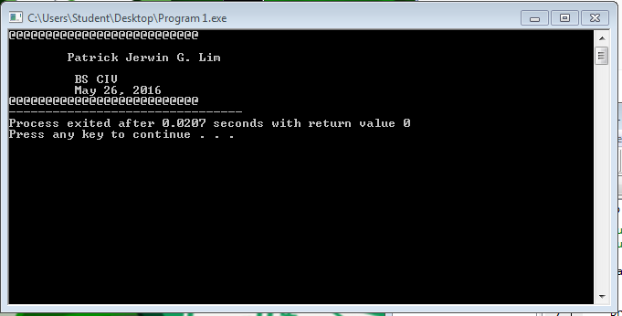
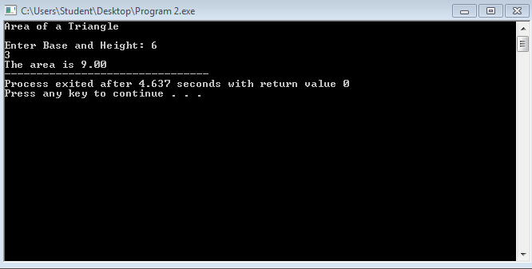
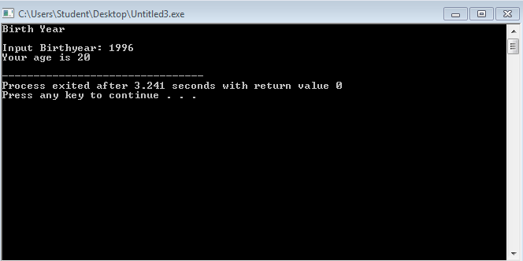
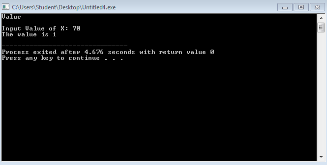

# Activity1-LimP

Lim, Patrick Jerwin G.

```
PROGRAM 1
#include <stdio.h>
#include <stdlib.h>

int main ()

{
	printf("@@@@@@@@@@@@@@@@@@@@@@@@@@");
	printf("\n\n\tPatrick Jerwin G. Lim");
	printf("\n\n\t BS CIV");
	printf("\n\t May 26, 2016");
	printf("\n@@@@@@@@@@@@@@@@@@@@@@@@@@");


	return 0;
	system("PAUSE");	
}

```

```
PROGRAM 2
#include <stdio.h>
#include <stdlib.h>

int main ()

{

float b,h,a;


	printf("Area of a Triangle");
	printf("\n\nEnter Base and Height: ");
	scanf("%f%f", &b,&h);
	a=b*h/2;
	
	printf("The area is %.2f",a);
	
	return 0;
	system ("PAUSE");
}
```

```
PROGRAM 3
#include <stdio.h>
#include <stdlib.h>

int main ()

{

int b,a;


	printf("Birth Year");
	printf("\n\nInput Birthyear: ");
	scanf("%d", &b);
	
	a=2016-b;
	
	
	printf("Your age is %d\n",a);
	
	return 0;
	system ("PAUSE");
}
```

```
PROGRAM 4
#include <stdio.h>
#include <stdlib.h>

int main ()

{

int x,y;


	printf("Value");
	printf("\n\nInput Value of X: ");
	scanf("%d", &x);
	
	y=x/70;
	
	
	printf("The value is %d\n",y);
	
	return 0;
	system ("PAUSE");
}
```

